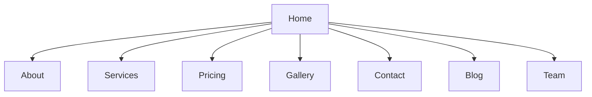

# 🧸 Happy Tots Day Care - Educational Website


## 🌟 About The Project
A modern, responsive website for Happy Tots Day Care center featuring:
- Multi-page educational platform
- Responsive Webflow-based design
- Interactive elements and galleries
- Contact forms and service information

## 🖥️ Pages Structure


## 🛠️ Technical Stack
| Component       | Technology Used |
|-----------------|-----------------|
| Frontend        | HTML5, CSS3, JavaScript |
| Framework       | Webflow         |
| Responsiveness  | Mobile-first design |
| Hosting         | GitHub Pages (configurable) |

## 🚀 Features
- ✅ Fully responsive navigation
- 📸 Interactive image galleries
- 📝 Functional contact forms
- 🎨 Consistent branding throughout
- 📱 Optimized for all devices

## 🏗️ Project Structure
```
Happy-Tots-Day-Care/
├── about/               # About page and assets
├── blog/                # Blog section
├── contact/             # Contact page
├── gallery/             # Photo gallery
├── pricing/             # Pricing plans
├── services/            # Services offered
├── team/                # Staff information
├── css/                 # Global styles
├── js/                  # JavaScript files
├── images/              # All image assets
├── index.html           # Homepage
└── README.md            # This file
```

## 🧰 Setup & Deployment
1. **Local Development**:
   ```bash
   # Run local server
   python -m http.server 8000
   ```
2. **GitHub Pages**:
   - Go to Repository Settings > Pages
   - Select `main` branch and `/ (root)` folder
   - Save to deploy

## 📜 License
This project is licensed under the MIT License - see [LICENSE.md](LICENSE.md) for details.

## ✉️ Contact
For inquiries: contact@happytots.example.com  
[](https://dualnova-labs.github.io/Happy-Tots-Day-Care/)