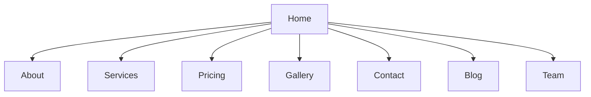

# 🧸 Happy Tots Day Care - Educational Website


## 🌟 About The Project
A modern, responsive website for Happy Tots Day Care center featuring:
- Multi-page educational platform
- Responsive Webflow-based design
- Interactive elements and galleries
- Contact forms and service information

## 🖥️ Pages Structure


## 🛠️ Technical Stack
| Component       | Technology Used |
|-----------------|-----------------|
| Frontend        | HTML5, CSS3, JavaScript |
| Framework       | Webflow         |
| Responsiveness  | Mobile-first design |
| Hosting         | GitHub Pages (configurable) |

## 🚀 Features
- ✅ Fully responsive navigation
- 📸 Interactive image galleries
- 📝 Functional contact forms
- 🎨 Consistent branding throughout
- 📱 Optimized for all devices

## 🏗️ Project Structure
```
Happy-Tots-Day-Care/
├── about/               # About page and assets
├── blog/                # Blog section
├── contact/             # Contact page
├── gallery/             # Photo gallery
├── pricing/             # Pricing plans
├── services/            # Services offered
├── team/                # Staff information
├── css/                 # Global styles
├── js/                  # JavaScript files
├── images/              # All image assets
├── index.html           # Homepage
└── README.md            # This file
```

## 🔥 Firebase Integration

### Configuration
1. Replace placeholder values in `/js/firebase-config.js` with your actual Firebase credentials
2. The following Firebase services are initialized:
   - Firestore (NoSQL database)
   - Authentication (User management)
   - Storage (File uploads)

### Available Features
- User authentication system
- Real-time database updates
- Image/file storage

### Firestore Collections Structure

| Collection | Description | Sample Fields |
|-----------|-------------|---------------|
| `users` | User profiles | `name`, `email`, `role` |
| `blogPosts` | Blog articles | `title`, `content`, `author` |
| `enquiries` | Contact forms | `name`, `email`, `message` |
| `gallery` | Image metadata | `url`, `caption`, `timestamp` |

### Authentication Guide

#### Features
- Email/password registration
- Google Sign-In
- Password reset
- Email verification

#### Testing
1. Visit `/contact.html`
2. Use the auth form to:
   - Register new account
   - Login
   - Reset password

#### Testing Google Sign-In
1. Click the Google Sign-In button
2. Select a Google account
3. Verify successful login and profile creation

#### Admin Access
View users in [Firebase Console](https://console.firebase.google.com/) > Authentication

### Development Notes
- All Firebase services are initialized on page load
- Error handling is implemented for failed initializations
- Compatability mode is used for wider browser support

## 👨‍💻 Admin Dashboard

### Access Requirements
- User must have `admin` claim set
- Accessed at `/admin/index.html`

### Current Features
- User statistics overview
- Admin access verification

### Setup
1. Set admin claim for a user:
```javascript
await adminAuth.setCustomUserClaims(uid, { admin: true });
```

### Admin Features Guide

#### User Management
- View all registered users
- Grant/revoke admin privileges
- Filter by name/email

#### Access Control
- Protected admin routes
- Role-based permissions
- Activity logging

#### Usage
1. Access `/admin/index.html`
2. Must have admin privileges
3. Manage users via interactive table

## 🔒 Security Rules

### Firestore Rules
- Users can only edit their own profiles
- Admins have full access

### Storage Rules
- User-specific file protection
- Public read-only content

### Testing
```bash
firebase emulators:start
```

### Deployment
```bash
firebase deploy --only firestore:rules,storage:rules
```

## 🧰 Setup & Deployment
1. **Local Development**:
   ```bash
   # Run local server
   python -m http.server 8000
   ```
2. **GitHub Pages**:
   - Go to Repository Settings > Pages
   - Select `main` branch and `/ (root)` folder
   - Save to deploy

## 🚀 Deployment Checklist

1. [ ] Set up first admin user
2. [ ] Test rules locally with emulator
3. [ ] Deploy to Firebase
4. [ ] Verify production access
5. [ ] Monitor usage in Firebase Console

## 📜 License
This project is licensed under the MIT License - see [LICENSE.md](LICENSE.md) for details.

## ✉️ Contact
For inquiries: contact@happytots.example.com  
[](https://dualnova-labs.github.io/Happy-Tots-Day-Care/)